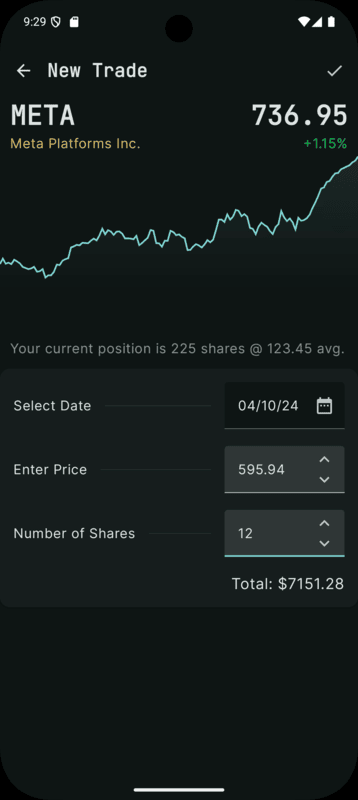
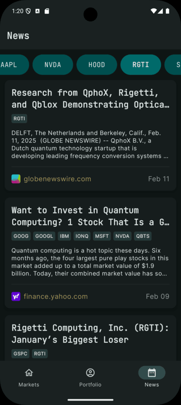

# <div align="center">WealthGrid</div>

<div align="center">

[](https://kotlinlang.org)
[](https://developer.android.com/reference)
[](https://developer.android.com/jetpack/compose)

This is a personal project focused on exploring modern Android development practices and learning new technologies. While the business logic might be simplistic, the technical implementation aims to follow production-grade standards and best practices.

Designed and developed by [me](https://www.linkedin.com/in/philip-tochkov/)


</div>


## 🛠️ Tech Stack

- **Clean Architecture** with **MVVM** presentation layer
- **Reactive streams**: Kotlin Flow
- **DI**: Hilt
- **UI Toolkit**:
    - Jetpack Compose
    - Compose Navigation
    - Material3
    - [Vico](https://github.com/patrykandpatrick/vico) and [ComposeCharts](https://github.com/ehsannarmani/ComposeCharts) for data visualization
    - Coil for image loading
    - Custom animations
- **Local Storage**: Room
- **Network**: [Ktorfit](https://github.com/Foso/Ktorfit) for REST API, Ktor for WSS
- **Testing**:
    - Unit Tests with JUnit, Thruth & MockK
    - UI Tests with Espresso **//TODO**
- **CI/CD**: GitHub Actions **//TODO**

## 📥 Installation

Clone the repository 
```bash
git clone https://github.com/tochkov/WealthGrid.git
```
Or download [apk](./.demo/WealthGrid-debug.apk)

> 🔑 To use the app you need an API key from [EODHD](https://eodhd.com/)
> 
> ⚠️ The project is using experimental features so you need to [Enable K2 Kotlin Mode](https://blog.jetbrains.com/idea/2024/03/k2-kotlin-mode-alpha-in-intellij-idea/)


<!-- ## 🏗️ Architecture

The application follows Clean Architecture principles with MVVM pattern:

```
app/
├── data/          # Data layer with repositories and data sources
├── domain/        # Business logic and use cases
├── presentation/  # UI layer with ViewModels and Composables
└── di/            # Dependency injection modules
``` -->

## 🌟 Features

<table border="0">
  <tr>
    <td width="70%" valign="top">
      <h3>📊 Markets Dashboard</h3>
      <p>Experience a comprehensive market overview with real-time data and interactive charts.</p>
      <ul>
        <li>Custom animated splash screen</li>
        <li>Major market indices charts</li>
        <li>Top companies listing</li>
        -
        <li>Real-time market data updates with Ktor WSS and Kotlin Flow</li>
        <li>Historical chart data is cached because it's immutable by nature</li>
        <li>Latest prices cahced for better UX</li>
        <li>Shared element transition animations</li>
      </ul>
    </td>
    <td width="30%">
      
    </td>
  </tr>
</table>

<table border="0">
  <tr>
      <td width="30%">
      
    </td>
    <td width="70%" valign="top">
      <h3>💼 Portfolio Management</h3>
      <p>Keep track of your investments with an intuitive and visually appealing interface.</p>
      <ul>
        <li>Interactive pie chart for portfolio distribution</li>
        <li>Detailed position tracking</li>
        <li>Real time prices and updates</li>
        <li>Performance analytics</li>
        <li>Gain/Loss visualization</li>
        <li>Sorting</li>
      </ul>
    </td>

  </tr>
</table>

<table border="0">
  <tr>
    <td width="70%" valign="top">
      <h3>📝 Submit Trade</h3>
      <p>Effortlessly manage your trades with our streamlined process.</p>
      <ul>
        <li>Intuitive search</li>
        <li>Interactive chart</li>
        <li>Date picker</li>
        <li>Safe cancel Dialog</li>
        <li>Transaction history</li>
      </ul>
    </td>
    <td width="30%">
      
    </td>
  </tr>
</table>

<table border="0">
  <tr>
      <td width="30%">
      
    </td>
    <td width="70%" valign="top">
      <h3>📰 Market News</h3>
      <p>Stay informed with the latest market news and updates.</p>
      <ul>
        <li>Customizable news feed</li>
        <li>Multiple news sources</li>
        <li>Category filtering</li>
        <li>Infinite scroll pagination</li>
        <li>Pull-to-refresh functionality</li>
      </ul>
    </td>

  </tr>
</table>


## 📝 Current TODOs and Improvements

- Markets screen smoother loading
- Refactoring - this project was quickly bootstrapped while I was learning most of the technologies
- Add more unit tests and advanced testing
- Company Details Screen - started
- More Portfolio charts and stats in Portfolio Screen
- Position Details - with more position data and list of trades
- Implement proper CI/CD pipeline
- Add Crypto and custom assets

## 🚀 Product Requirements

To make this a real world business product, it would need:

- Better API providers and/or custom BE solution
- Way more complex trade logic with fees, selling, leverage, etc
- Watchlists and multiple portfolios
- Advanced analytics and reporting
- Import trades from provider - Theoretically it is possible to utilize the latest AI technologies and import trades from screenshots (Image to structured json)
- Export portfolio or cloud solution (Firebase, custom)


## 🤝 Contributing

This project is primarily for demonstration purposes, but suggestions and feedback are welcome! Feel free to:
- Open issues
- Submit pull requests
- Share improvement ideas


## 📱 Screenshots

<table border="0">
  <tr>
    <td></td>
    <td></td>
    <td></td>
    <td></td>
    <td></td>
    <td></td>
  </tr>
</table>

Supports light theme, but was not in focus during development...

<table border="0">
  <tr>
    <td></td>
    <td></td>
    <td></td>
    <td></td>
    <td></td>
    <td></td>
  </tr>
</table>