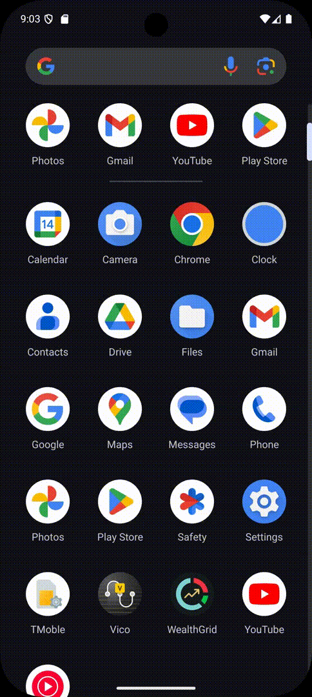
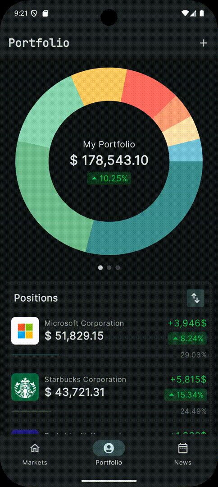

# 📈 WealthGrid

[](https://developer.android.com/reference)
[](https://kotlinlang.org)
[](https://developer.android.com/jetpack/compose)

A modern Android application for exploring stock markets, managing portfolios, and staying updated with market news. Built with the latest Android development practices and libraries.


## 🌟 Features

<table>
  <tr>
    <td width="70%" valign="top">
      <h3>📊 Markets Dashboard</h3>
      <p>Experience a comprehensive market overview with real-time data and interactive charts.</p>
      <ul>
        <li>Custom animated splash screen</li>
        <li>Major market indices tracking</li>
        <li>Interactive price charts</li>
        <li>Top companies listing</li>
        <li>Real-time market data updates</li>
      </ul>
    </td>
    <td width="30%">
      
    </td>
  </tr>
</table>

<table>
  <tr>
    <td width="70%" valign="top">
      <h3>💼 Portfolio Management</h3>
      <p>Keep track of your investments with an intuitive and visually appealing interface.</p>
      <ul>
        <li>Interactive pie chart for portfolio distribution</li>
        <li>Detailed position tracking</li>
        <li>Performance analytics</li>
        <li>Gain/Loss visualization</li>
      </ul>
    </td>
    <td width="30%">
      
    </td>
  </tr>
</table>

<table>
  <tr>
    <td width="70%" valign="top">
      <h3>📝 Trade Management</h3>
      <p>Effortlessly manage your trades with our streamlined process.</p>
      <ul>
        <li>Quick trade entry</li>
        <li>Position cost averaging</li>
        <li>Transaction history</li>
        <li>Trade performance tracking</li>
      </ul>
    </td>
    <td width="30%">
      
    </td>
  </tr>
</table>

<table>
  <tr>
    <td width="70%" valign="top">
      <h3>📰 Market News</h3>
      <p>Stay informed with the latest market news and updates.</p>
      <ul>
        <li>Customizable news feed</li>
        <li>Multiple news sources</li>
        <li>Category filtering</li>
        <li>Infinite scroll pagination</li>
        <li>Pull-to-refresh functionality</li>
      </ul>
    </td>
    <td width="30%">
      
    </td>
  </tr>
</table>

## 🛠️ Tech Stack

- **Architecture Pattern**: MVVM with Clean Architecture
- **Dependency Injection**: Hilt
- **Asynchronous Programming**: Kotlin Coroutines & Flow
- **UI Components**: 
  - Material Design 3
  - Custom animations
  - MPAndroidChart for data visualization
- **Local Storage**: Room Database
- **Network**: Retrofit with OkHttp
- **Image Loading**: Coil
- **Testing**: 
  - Unit Tests with JUnit & Mockito
  - UI Tests with Espresso
- **CI/CD**: GitHub Actions

## 📱 Screenshots

<table>
  <tr>
    <td></td>
    <td></td>
    <td></td>
  </tr>
  <tr>
    <td>Markets Dashboard</td>
    <td>Portfolio View</td>
    <td>News Feed</td>
  </tr>
</table>

## 🏗️ Architecture

The application follows Clean Architecture principles with MVVM pattern:

```
app/
├── data/          # Data layer with repositories and data sources
├── domain/        # Business logic and use cases
├── presentation/  # UI layer with ViewModels and Composables
└── di/            # Dependency injection modules
```

## 🚀 Installation

1. Clone the repository
```bash
git clone https://github.com/yourusername/stockmarket-explorer.git
```

2. Open in Android Studio

3. Run the app on an emulator or physical device

## 🤝 Contributing

This project is primarily for demonstration purposes, but suggestions and feedback are welcome! Feel free to:
- Open issues
- Submit pull requests
- Share improvement ideas

## 📄 License

```
MIT License

Copyright (c) [Year] [Your Name]

Permission is hereby granted, free of charge...
```

## 📞 Contact

- LinkedIn: [Your LinkedIn Profile](your-linkedin-url)
- Email: your.email@example.com
- Portfolio: [Your Portfolio](your-portfolio-url)